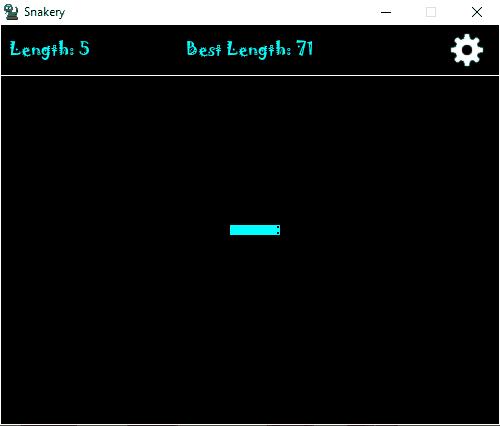
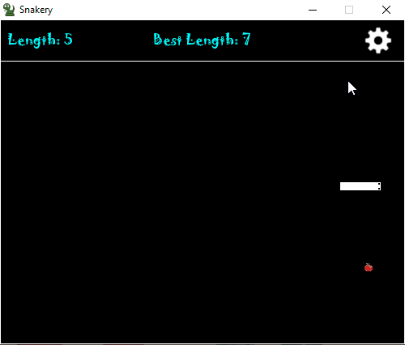

# About
Recreation of the traditional snake game, made with pygame.

# Objective
Grow as large as possible.
The snake grows by eating food as it spawns in random places across the map.
The game ends when the snake collides its own body. When the game is over, the player is given the option of playing again or quitting.  

  

# Controls
The snake is moved with arrow keys and/or WASD.
Settings menu is displayed by clicking on the gear icon on the top right corner of the game window.

# Features
* Settings menu
* Ability to change the snake's primary color and eye color
* Ability to disable/enable sound effects 
* Best length is saved to a local text file on the machine that runs the game.
* The best length may be reset  

  

# Installation
An exe build is available for windows users, all you have to do is download the exe in the project's dist folder and play!
Non-windows users can run the source code if they have python installed.
